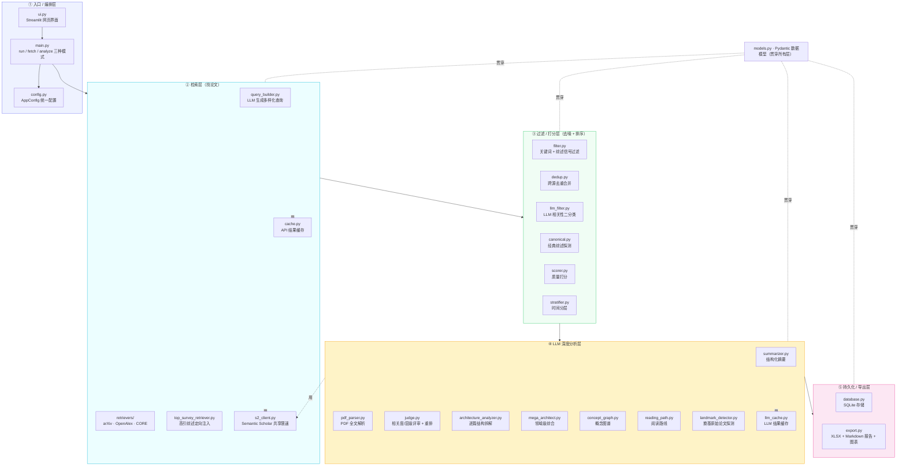
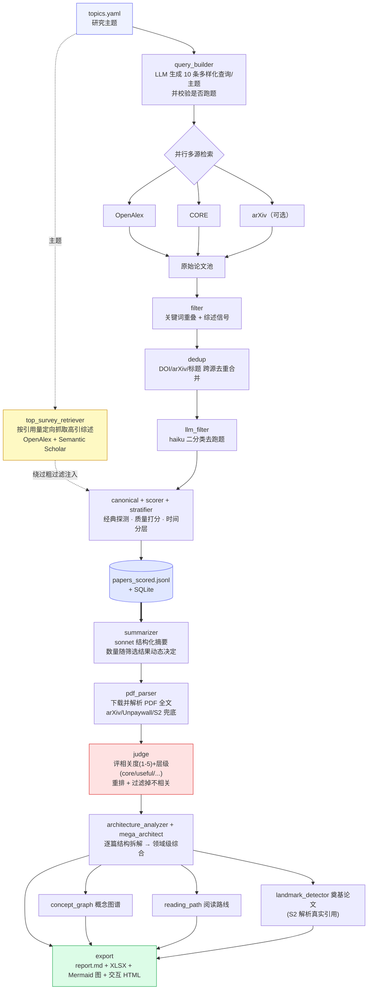
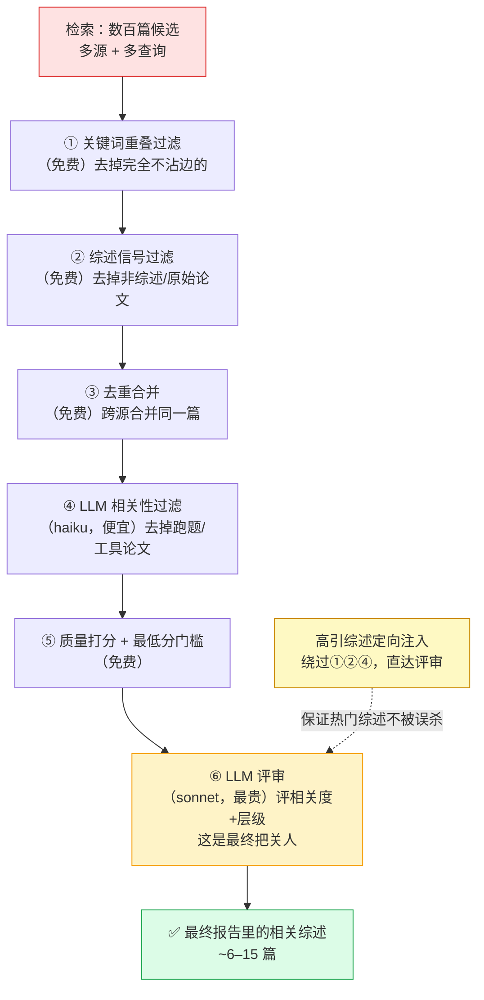
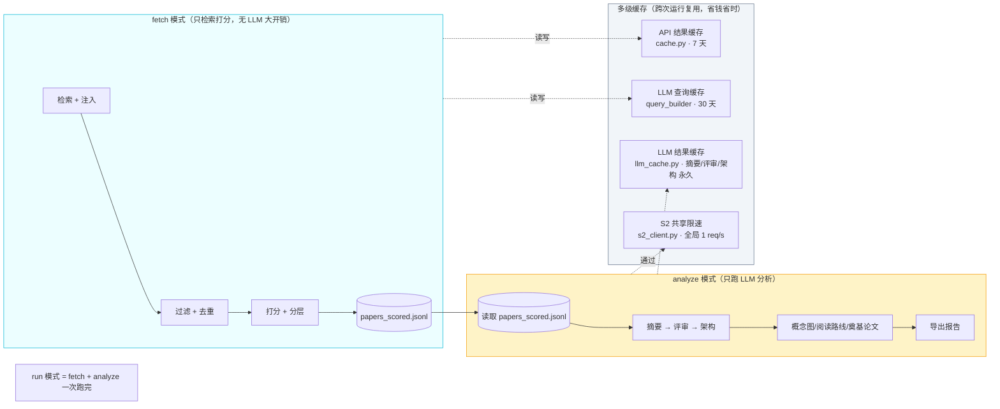

# 架构与流程说明 · Survey Paper Miner

> 一个自动发现、筛选、深度分析某个研究领域**综述论文**的流水线。
> 输入：几个研究主题（如 *Agentic RAG Systems*）；输出：一份结构化的领域综述报告（领域地图、核心问题、研究空白、阅读路线、概念图、奠基论文、逐篇论文卡片）。

---

## 设计理念（为什么是这样的架构）

这个系统要解决三个核心难题，架构正是围绕它们组织的：

| 难题 | 后果 | 架构对策 |
|---|---|---|
| **召回**：怎么把领域里重要的综述都找到？ | 漏掉热门综述 | 多源检索 + LLM 生成多样化查询 + **高引综述定向注入** |
| **精度**：怎么把无关/跑题/非综述的噪音去掉？ | 报告被噪音淹没 | **四层过滤漏斗**（关键词→综述信号→去重→LLM 相关性）+ **LLM 评审**按相关度/层级把关 |
| **成本与可信**：LLM 调用贵、会幻觉、外部 API 会限速/不稳 | 又贵又不可靠 | **两阶段拆分** + **多级缓存** + 结构化 JSON schema + 共享限速客户端 |

一句话：**召回靠"广撒网 + 定向补漏"，精度靠"漏斗 + 评审双重把关"，成本与稳定靠"缓存 + 分阶段 + 限速"。**

---

## 图 1 · 分层架构

---

## 图 2 · 端到端流程（从主题到报告）

---

## 图 3 · 质量漏斗（为什么需要这么多过滤层）

每一层都用**越来越贵但越来越聪明**的手段去噪——便宜的关键词过滤先砍掉大部分，最贵的 LLM 评审只处理最后的精选集。

---

## 图 4 · 两阶段模式 + 缓存（为什么这样省钱又稳）

**为什么拆两阶段？** 检索是廉价的、可缓存的；LLM 分析是昂贵的。拆开后，你可以反复调分析参数（换 tier、换阈值、重跑报告）而**不必重新检索**，也不会重复花 LLM 的钱。

---

## 模块清单 · 每个模块为什么存在

### ① 入口 / 编排层
| 模块 | 作用 | 为什么需要 |
|---|---|---|
| `main.py` | 编排整条流水线，提供 `run/fetch/analyze` 三种模式 | 单一入口；两阶段拆分让"反复调分析"不必重检索 |
| `ui.py` | Streamlit 网页界面 | 让非命令行用户也能配置、运行、看实时日志和产物 |
| `config.py` | 把 YAML + 环境变量加载成统一的 `AppConfig` | 所有可调参数集中一处，CLI/UI 行为一致 |
| `models.py` | Pydantic 数据模型（Paper / ScoredPaper / JudgeResult / …） | 各模块之间用强类型对象传递，杜绝字段拼写错误、便于 JSONL 持久化 |

### ② 检索层（找论文）
| 模块 | 作用 | 为什么需要 |
|---|---|---|
| `query_builder.py` | 用 LLM 为每个主题生成 10 条多样化查询，并校验是否跑题 | 关键词交叉乘积召回差；LLM 用同义词/子主题大幅提升召回，同时防止漂移 |
| `retrievers/`（base/openalex/core/arxiv） | 各学术库的检索适配器，带重试和限速 | 多源覆盖更全；OpenAlex 主力，CORE 补开放获取，arXiv 可选 |
| `top_survey_retriever.py` | 按**引用量**定向抓取热门综述（OpenAlex + S2，含缩写式查询） | LLM 查询会漏掉不同措辞的热门综述（如 GraphRAG、RAG-Reasoning）；这一步**保证热门综述不被漏掉** |
| `cache.py` | 按 (源,查询,年份,数量) 缓存 API 结果，7 天 TTL | 重跑时不再打外部 API，秒级完成 |
| `s2_client.py` | Semantic Scholar 的**全局共享限速客户端**（≥1 req/s） | S2 限速"跨所有端点累计 1 次/秒"，必须有一个全局闸门统一管控 |

### ③ 过滤 / 打分层（去噪 + 排序）
| 模块 | 作用 | 为什么需要 |
|---|---|---|
| `filter.py` | 关键词重叠 + 综述信号双重过滤（免费） | 先用零成本手段砍掉绝大部分明显无关/非综述的论文 |
| `dedup.py` | DOI→arXiv→标题→模糊标题 多键去重并合并元数据 | 多源/多查询会重复命中同一篇；合并取最高引用、最长摘要 |
| `llm_filter.py` | haiku 对每篇做"是否该主题综述"二分类 | 捕捉关键词骗过去但实则跑题/工具论文/非英文的（便宜的智能过滤） |
| `canonical.py` | 探测领域经典综述，写入 canonical 分数 | 让公认的奠基综述在打分中得到加权 |
| `scorer.py` | 综合质量打分（venue/引用/综述信号/结构/时效/经典） | 给论文排序，决定优先分析谁 |
| `stratifier.py` | 给论文打时间层级（foundational/current/emerging） | 让阅读路线能"从经典到前沿"地排序 |

### ④ LLM 深度分析层
| 模块 | 作用 | 为什么需要 |
|---|---|---|
| `summarizer.py` | sonnet 生成结构化摘要（范围/方法/发现/局限…） | 把论文压缩成机器可用的结构化字段，供后续所有分析使用 |
| `pdf_parser.py` | 下载并解析 PDF 全文（arXiv/Unpaywall/S2 多级兜底） | 摘要信息有限；全文的相关工作/结论能让架构分析更准 |
| `judge.py` | 评每篇的**主题相关度(1-5)+ 层级(core/useful/marginal/cut)**，重排并过滤 | **最终质量把关人**——把跑题、领域专用、非综述的踢出最终报告 |
| `architecture_analyzer.py` | 逆向拆解每篇综述"如何组织这个领域"（分类法/方法族/挑战） | 报告的核心：不是讲论文"说了什么"，而是它"怎么组织领域" |
| `mega_architect.py` | 把多篇的结构综合成**领域级超级架构** | 跨综述综合出领域地图、核心问题、研究空白 |
| `concept_graph.py` | 抽取概念 + 类型化关系，生成概念图谱 | 给读者一张"领域概念如何关联"的图 |
| `reading_path.py` | 为新手生成有序阅读路线 | 把一堆论文变成"先读哪篇、为什么、读哪节" |
| `landmark_detector.py` | 找出综述们反复引用的**奠基原始论文**（ReAct/Self-RAG…），用 S2 取真实引用 | 综述本身不含原始技术论文；这一步帮新手直达"原始技术出处" |
| `llm_cache.py` | 内容寻址缓存摘要/评审/架构结果 | LLM 调用最贵；同一篇重跑直接命中，零成本 |

### ⑤ 持久化 / 导出层
| 模块 | 作用 | 为什么需要 |
|---|---|---|
| `database.py` | SQLite 存储论文与摘要（按标题 upsert） | 跨次运行增量积累，不重复 |
| `export.py` | 生成 XLSX + 每主题 `report.md`（含 Mermaid 图、交互式 HTML 思维导图、概念图、阅读路线、奠基论文表、逐篇卡片） | 把所有分析变成人可读、可展示的最终产物 |

---

## 数据流速览（一句话版）

> **主题 → 多样化查询 + 高引注入 → 多源检索 → 四层漏斗去噪 → 打分分层 →（存档）→ 动态数量摘要 → PDF 增强 → LLM 评审把关 → 逐篇/领域级架构 → 概念图/阅读路线/奠基论文 → 导出报告。**

每一步都遵循同一条原则：**先便宜后昂贵、先广召回后严把关、能缓存就缓存。**
