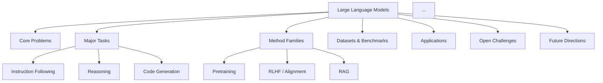
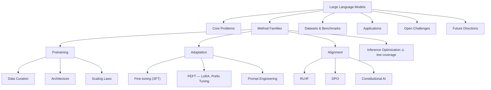

# AI Survey Paper Miner — MVP Design Doc

## 1. Project Overview

### 1.1 Project Name

**AI Survey Paper Miner**

### 1.2 One-Sentence Summary

AI Survey Paper Miner is a lightweight literature discovery tool that automatically searches for recent AI survey papers, deduplicates results, scores paper quality, summarizes top papers, extracts keywords, and exports a structured literature review table.

### 1.3 Motivation

Finding high-quality survey papers in AI is difficult because relevant papers are scattered across arXiv, Semantic Scholar, OpenAlex, conference proceedings, and journals. Manual searching is time-consuming, inconsistent, and prone to missing important papers.

This project aims to automate the first-pass literature review workflow:

1. Generate search queries from user-defined AI topics.
2. Retrieve candidate papers from multiple academic sources.
3. Deduplicate papers across sources.
4. Score papers by survey relevance, recency, citation impact, venue quality, and content structure.
5. Summarize the most relevant papers into structured JSON.
6. Export results as CSV, Markdown, and optionally JSONL.

The MVP focuses on reliable retrieval, scoring, and structured summarization rather than a full research assistant or RAG system.

---

## 2. Goals and Non-Goals

## 2.1 MVP Goals

The MVP should allow a user to input a list of AI research topics and receive a ranked table of recent high-quality survey papers.

### Core goals

1. **Topic-based search**
   - Accept a configurable list of AI topics.
   - Generate survey-related search queries automatically.
   - Search papers from multiple sources.

2. **Multi-source retrieval**
   - Retrieve metadata from:
     - Semantic Scholar
     - arXiv
     - OpenAlex
   - Normalize all retrieved papers into a shared schema.

3. **Deduplication**
   - Remove duplicates using DOI, arXiv ID, and title similarity.

4. **Authority detection**
   - Identify the most authoritative survey for each topic, not just any survey paper.
   - Use reverse reference analysis: papers that are consistently cited as background by other top papers are canonical.
   - Use influential citation ratio rather than raw citation count.
   - Classify each paper by authority tier: Foundational, Current Standard, or Emerging.

5. **Quality scoring**
   - Assign each paper a quality score from 0 to 100.
   - Score based on:
     - Survey signal
     - Citation impact (influential ratio, not raw count)
     - Recency
     - Venue/source quality
     - Abstract-level structure signal
     - Canonical survey signal from reverse reference analysis
     - Background citation context ratio

6. **Structured summarization**
   - For the top N papers, generate a structured summary using an LLM.
   - Extract:
     - Research scope
     - Core problem
     - Taxonomy
     - Main methods
     - Datasets and benchmarks
     - Evaluation metrics
     - Main findings
     - Limitations
     - Future directions
     - Keywords

7. **Field architecture analysis**
   - For each high-quality survey, reverse-engineer how it organizes the field: its core research questions, organizational logic, taxonomy, and coverage of methods / tasks / datasets / challenges / future directions.
   - Compare all survey architectures: orientation type, shared taxonomy dimensions, overlapping and conflicting frameworks.
   - Synthesize all individual architectures into one unified mega-architecture of the field.

8. **Export**
   - Export ranked results to CSV.
   - Export detailed summaries to JSONL.
   - Export a Markdown report grouped by topic, with authority tier labels.
   - Export per-survey architecture table, cross-survey comparison, unified mega-architecture, Mermaid diagram, research gap analysis, and a suggested structure for writing a new survey.

---

## 2.2 Non-Goals for MVP

The MVP will not include:

1. Full PDF parsing for every paper.
2. Citation graph visualization.
3. Browser-based UI.
4. User authentication.
5. Notion, Zotero, or Obsidian integration.
6. Full RAG question-answering over papers.
7. Automatic related work writing.
8. Automated correctness verification of LLM summaries.
9. Continuous background monitoring for new papers.
10. Multi-user collaboration features.

These can be added in later versions.

---

## 3. Target Users

### 3.1 Primary User

A researcher, graduate student, or research assistant who wants to quickly build a high-quality survey paper collection in an AI subfield.

### 3.2 Secondary Users

- Students preparing literature reviews.
- Researchers writing related work sections.
- Lab teams tracking new developments in AI.
- Engineers exploring technical domains before starting a project.

---

## 4. Example User Workflow

### Input

The user creates a `topics.yaml` file:

```yaml
topics:
  - large language models
  - retrieval augmented generation
  - LLM agents
  - multimodal large language models
  - AI safety
  - trustworthy AI

year_from: 2021
year_to: 2026
max_results_per_query: 20
top_n_to_summarize: 30
```

### Command

```bash
python main.py --config config/topics.yaml
```

### Output

The system generates:

```text
data/exports/papers_ranked.csv
data/exports/paper_summaries.jsonl
data/exports/survey_report.md
```

### Expected result

The user receives a ranked table such as:

| Title | Year | Venue | Topic | Citations | Quality Score | Keywords | URL |
|---|---:|---|---|---:|---:|---|---|
| A Survey on Large Language Models | 2023 | arXiv | LLMs | 3000 | 91 | LLM, alignment, pretraining | ... |
| Retrieval-Augmented Generation for Large Language Models: A Survey | 2024 | arXiv | RAG | 800 | 87 | RAG, retrieval, generation | ... |

---

## 5. System Architecture

## 5.1 High-Level Architecture

```text
User Config
    |
    v
Query Builder
    |
    v
Paper Retrievers
    |-- Semantic Scholar Retriever  (+ background citation context)
    |-- arXiv Retriever
    |-- OpenAlex Retriever
    |
    v
Paper Normalizer
    |
    v
Deduplicator
    |
    v
Canonical Survey Detector          <-- reverse reference analysis
    |
    v
Quality Scorer                     (influential ratio + canonical signal)
    |
    v
Temporal Stratifier                <-- Foundational / Current Standard / Emerging
    |
    v
Top-N Selector
    |
    v
LLM Summarizer + LLM-as-Judge      <-- authority assessment pass
    |
    v
Survey Architecture Analyzer       <-- per-paper architecture extraction
    |                                   + cross-survey comparison
    v
Field Mega-Architecture Synthesizer <-- unified field architecture
    |
    v
Exporter
    |-- CSV  (with authority_tier column)
    |-- JSONL
    |-- Markdown Report  (topic + tier + architecture)
    |-- Architecture Table (per-survey)
    |-- Cross-Survey Comparison
    |-- Mega-Architecture + Mermaid Diagram
    |-- Research Gap Analysis
    |-- New Survey Writing Guide
```

---

## 5.2 Module Responsibilities

### 5.2.1 Query Builder

Generates search queries from user-defined topics and survey-related terms.

Example:

```text
"large language models" "survey"
"large language models" "review"
"large language models" "taxonomy"
"retrieval augmented generation" "survey"
```

Responsibilities:

- Load topics from config.
- Combine topics with survey terms.
- Add year constraints where supported.
- Track which topic generated each query.

---

### 5.2.2 Paper Retrievers

Each retriever implements a common interface:

```python
class BaseRetriever:
    def search(self, query: str, year_from: int, year_to: int, limit: int) -> list[Paper]:
        raise NotImplementedError
```

MVP retrievers:

1. `SemanticScholarRetriever`
2. `ArxivRetriever`
3. `OpenAlexRetriever`

Each retriever should:

- Send API requests.
- Parse response data.
- Convert source-specific fields into the shared `Paper` schema.
- Handle failures gracefully.
- Log failed queries without stopping the whole pipeline.

The `SemanticScholarRetriever` should additionally fetch citation context data using the `/paper/{id}/citations` endpoint. For each citing paper, extract whether the citation intent is `background`, `method`, or `result`. This powers the `background_citation_count` field used in authority scoring.

```python
# Semantic Scholar citation context API
GET /graph/v1/paper/{paper_id}/citations
    ?fields=contexts,intents
```

When `intents` contains `"background"`, increment the paper's `background_citation_count`.

---

### 5.2.3 Paper Normalizer

Converts raw metadata into a standard format.

Shared `Paper` schema:

```python
class Paper(BaseModel):
    title: str
    year: int | None = None
    authors: list[str] = []
    venue: str | None = None
    abstract: str | None = None
    doi: str | None = None
    arxiv_id: str | None = None
    url: str | None = None
    pdf_url: str | None = None
    citation_count: int = 0
    influential_citation_count: int = 0
    background_citation_count: int = 0       # cited as background by other papers
    source: str | None = None
    topic_query: str | None = None
    generated_query: str | None = None
    canonical_score: float = 0.0             # set by Canonical Survey Detector
    authority_tier: str | None = None        # "foundational" | "current_standard" | "emerging"
```

---

### 5.2.4 Deduplicator

Removes duplicate papers retrieved from different sources.

Deduplication priority:

1. DOI exact match.
2. arXiv ID exact match.
3. Normalized title exact match.
4. Fuzzy title similarity above threshold, default 95/100.
5. Optional: title similarity plus same publication year.

When duplicates are found, the system should merge useful metadata instead of simply discarding one copy.

Merge rules:

- Prefer non-empty DOI.
- Prefer non-empty abstract.
- Prefer higher citation count.
- Merge source names into a list.
- Prefer open-access PDF URL if available.
- Preserve all matched topic queries.

---

### 5.2.5 Quality Scorer

Assigns a score from 0 to 100.

Scoring formula:

```text
quality_score =
    venue_score
  + citation_score
  + recency_score
  + survey_signal_score
  + structure_signal_score
  + canonical_score
```

Recommended weights:

| Component | Max Points |
|---|---:|
| Venue / source quality | 20 |
| Citation impact (influential ratio) | 20 |
| Recency | 10 |
| Survey signal | 15 |
| Structure signal | 15 |
| Canonical survey signal | 20 |
| Total | 100 |

#### Venue score

High-value venues include:

- ACM Computing Surveys
- Foundations and Trends in Machine Learning
- Journal of Machine Learning Research
- IEEE TPAMI
- IEEE TNNLS
- Artificial Intelligence Review
- TACL
- Nature Machine Intelligence
- NeurIPS
- ICML
- ICLR
- ACL
- EMNLP
- AAAI
- IJCAI

#### Citation score

Replace raw citation count with an influential citation ratio. This penalizes papers with many low-quality citations while promoting papers that have real academic impact.

```text
citations_per_year = citation_count / max(current_year - paper_year + 1, 1)

influential_ratio = influential_citation_count / max(citation_count, 1)

citation_score = 0.4 * normalize(citations_per_year)
              + 0.6 * normalize(influential_ratio)
```

Both terms are normalized against the top value in the current result set before weighting.

#### Background citation ratio

Separately track the fraction of citations where the citing paper uses this survey as a background reference. A high ratio indicates that researchers treat this paper as "the" standard reference for the topic.

```text
background_ratio = background_citation_count / max(citation_count, 1)
```

This feeds into the canonical score (see Section 5.2.6).

#### Survey signal score

Check whether title or abstract contains terms such as:

- survey
- review
- systematic review
- taxonomy
- overview
- comprehensive
- literature review
- bibliometric

#### Structure signal score

Check whether abstract or available text includes terms such as:

- taxonomy
- benchmark
- dataset
- evaluation
- future directions
- open challenges
- limitations
- comparison
- classification

#### Canonical score

Populated by the Canonical Survey Detector (Section 5.2.6). Reflects how frequently this paper appears in the reference lists of other top papers in the same topic and how high the background citation ratio is.

---

### 5.2.6 Canonical Survey Detector

Identifies which papers are treated as the authoritative survey for each topic by analyzing reverse reference patterns — papers that other researchers consistently cite as background are canonical by definition.

#### Algorithm

```text
1. From the deduplicated result set, take the top-K papers per topic
   by raw citation count (default K = 50).

2. For each of these papers, fetch its reference list via the
   Semantic Scholar /references endpoint.

3. Aggregate reference counts:
   canonical_mention_count[paper_id] += 1 for each appearance in any reference list.

4. Combine with background_citation_count from retrieval:
   canonical_score = 0.5 * normalize(canonical_mention_count)
                   + 0.5 * normalize(background_ratio)

5. Write canonical_score back to each Paper object.
```

#### Why this works

If papers A, B, C, D all cite survey S in their reference lists, S is likely the field's standard reference — regardless of whether S appeared at the top of a keyword search.

This approach surfaces older foundational surveys that may not rank highly on recency but are universally acknowledged by the community.

#### Configuration

```yaml
canonical_detector:
  enabled: true
  top_k_seed_papers: 50       # papers whose reference lists are analysed
  min_mention_count: 2        # minimum appearances to receive a non-zero canonical score
```

---

### 5.2.7 Temporal Stratifier

Classifies each paper into an authority tier based on its citation trajectory, not just its total count. Each tier answers a different researcher need.

| Tier | Label | Definition |
|---|---|---|
| 1 | `foundational` | Published ≥ 4 years ago, citation count in top 10% of topic, citation growth now plateaued |
| 2 | `current_standard` | Published 1–4 years ago, citations/year in top 25% of topic |
| 3 | `emerging` | Published ≤ 2 years ago, citations/year growing, not yet in top tiers |

#### Classification rules

```text
age = current_year - paper_year

if age >= 4 and citations_per_year_rank <= 0.10:
    tier = "foundational"
elif 1 <= age <= 4 and citations_per_year_rank <= 0.25:
    tier = "current_standard"
elif age <= 2:
    tier = "emerging"
else:
    tier = None
```

Papers can hold only one tier; foundational takes precedence.

The Markdown report and CSV export both include the `authority_tier` column, and the Markdown report groups papers by tier within each topic section.

---

### 5.2.8 LLM Summarizer

The summarizer runs only on top-ranked papers to control cost.

Default behavior:

```text
summarize_top_n = 30
```

Input:

- Title
- Abstract
- Venue
- Year
- Optional PDF text if available in later versions

Output JSON:

```json
{
  "research_scope": "...",
  "core_problem": "...",
  "taxonomy": ["..."],
  "main_methods": ["..."],
  "representative_papers_or_models": ["..."],
  "datasets_and_benchmarks": ["..."],
  "evaluation_metrics": ["..."],
  "main_findings": ["..."],
  "limitations": ["..."],
  "future_directions": ["..."],
  "keywords": {
    "tasks": ["..."],
    "methods": ["..."],
    "models": ["..."],
    "datasets": ["..."],
    "evaluation": ["..."],
    "risks": ["..."]
  },
  "citation_use_cases": ["..."]
}
```

Important summarization rules:

- Preserve concrete technical terms.
- Do not invent datasets or benchmarks.
- If unavailable, return an empty list.
- Prefer short, structured summaries over long prose.
- Include uncertainty when abstract-only summarization is used.

---

### 5.2.9 LLM-as-Judge (Authority Assessment)

A second, lightweight LLM pass that runs only on papers that passed the Top-N threshold. Where the summarizer extracts content, the judge assesses authority — it answers whether this paper deserves to be called "the" survey for the topic.

This pass is separate from summarization to keep prompts focused and costs predictable. It can be disabled via config.

Input:

- Title
- Abstract
- Venue
- Year
- citation_count, influential_citation_count, background_citation_count
- canonical_score
- authority_tier assigned by Temporal Stratifier

Output JSON:

```json
{
  "is_survey": true,
  "authority_assessment": "foundational | current_standard | emerging | not_a_survey",
  "scope_clarity": "broad | narrow | unclear",
  "coverage_depth": "comprehensive | partial | shallow",
  "strengths": ["..."],
  "weaknesses": ["..."],
  "recommended_action": "must_read | worth_reading | optional | skip",
  "confidence": 0.85
}
```

Rules:

- If `is_survey` is false, set `recommended_action` to `skip` regardless of other fields.
- If the abstract is very short (under 100 words), set `confidence` to at most 0.5.
- Do not invent claims not supported by the abstract.
- If the LLM-assigned `authority_assessment` contradicts the Temporal Stratifier tier, log the conflict but prefer the LLM assessment in the final output.

Configuration:

```yaml
llm_judge:
  enabled: true
  judge_top_n: 50           # run judge on top 50 papers only
  model: "claude-sonnet-4-6"
```

---

### 5.2.10 Survey Architecture Analyzer

Runs after summarization. For each paper in the top-N set, performs a dedicated LLM pass that reverse-engineers how the paper organizes its field — not what the paper says, but how it thinks about the field.

#### Per-paper architecture extraction

Input per paper:

- Title, abstract, venue, year
- LLM summary fields already extracted (taxonomy, main\_methods, datasets, evaluation\_metrics, challenges, future\_directions)

Output JSON per paper:

```json
{
  "paper_id": "...",
  "title": "...",
  "orientation": "task | method | application | timeline | challenge | hybrid",
  "core_research_questions": ["..."],
  "organizational_logic": "...",
  "top_level_taxonomy": ["..."],
  "second_level_taxonomy": {"category": ["subcategory", "..."]},
  "covered_tasks": ["..."],
  "covered_methods": ["..."],
  "covered_datasets": ["..."],
  "covered_applications": ["..."],
  "covered_challenges": ["..."],
  "covered_future_directions": ["..."],
  "notable_omissions": ["..."],
  "structural_strengths": ["..."],
  "structural_weaknesses": ["..."]
}
```

**Orientation types:**

| Type | Meaning |
|---|---|
| `task` | Organized around what the system is asked to do |
| `method` | Organized around algorithmic or model families |
| `application` | Organized around deployment domains |
| `timeline` | Organized chronologically by development era |
| `challenge` | Organized around unsolved problems |
| `hybrid` | Combines two or more of the above |

#### Cross-survey comparison

After all per-paper architectures are extracted, run a second LLM pass over the full set for the topic.

Input: all per-paper architecture JSONs for a single topic.

Output JSON:

```json
{
  "topic": "...",
  "orientation_distribution": {
    "task": 3,
    "method": 5,
    "application": 1,
    "timeline": 1,
    "challenge": 2,
    "hybrid": 4
  },
  "shared_taxonomy_dimensions": ["..."],
  "conflicting_classifications": [
    {
      "dimension": "...",
      "paper_a": "...",
      "paper_a_view": "...",
      "paper_b": "...",
      "paper_b_view": "..."
    }
  ],
  "complementary_coverage": [
    {
      "aspect": "...",
      "best_covered_by": "paper title"
    }
  ],
  "best_overall_structure": "paper title",
  "best_overall_structure_reason": "...",
  "coverage_gaps_across_all_surveys": ["..."]
}
```

#### Configuration

```yaml
architecture_analyzer:
  enabled: true
  analyze_top_n: 20        # per-paper extraction runs on top 20 papers per topic
  model: "claude-sonnet-4-6"
```

---

### 5.2.11 Field Mega-Architecture Synthesizer

Takes all per-paper architectures and the cross-survey comparison for a topic and synthesizes them into one unified hierarchical architecture of the field. This is the culminating analytical output of the system.

#### Algorithm

```text
1. Collect all per-paper architecture JSONs for a topic.
2. Merge taxonomy trees: union of all top-level categories,
   resolving synonym conflicts via LLM.
3. Aggregate coverage lists (tasks, methods, datasets, etc.)
   and deduplicate by semantic similarity.
4. Score each element by how many surveys cover it
   (frequency = importance signal).
5. Identify gaps: elements mentioned only as future work or
   omissions across multiple surveys.
6. Produce unified mega-architecture JSON.
7. Render Mermaid diagram from the JSON.
8. Generate a suggested new survey outline.
```

#### Mega-architecture output JSON

```json
{
  "topic": "...",
  "generated_at": "...",
  "source_papers": ["..."],
  "mega_architecture": {
    "core_problems": ["..."],
    "major_tasks": {
      "task_name": {
        "description": "...",
        "covered_by_n_surveys": 7,
        "subtasks": ["..."]
      }
    },
    "method_families": {
      "family_name": {
        "description": "...",
        "representative_methods": ["..."],
        "covered_by_n_surveys": 5
      }
    },
    "datasets_and_benchmarks": [
      {
        "name": "...",
        "task": "...",
        "covered_by_n_surveys": 4
      }
    ],
    "evaluation_metrics": ["..."],
    "applications": ["..."],
    "challenges": {
      "challenge": {
        "description": "...",
        "severity": "high | medium | low",
        "covered_by_n_surveys": 6
      }
    },
    "future_research_directions": ["..."],
    "open_gaps": ["..."]
  },
  "suggested_new_survey_outline": {
    "title_template": "...",
    "abstract_template": "...",
    "sections": [
      {
        "section_number": 1,
        "title": "Introduction",
        "content_hints": ["..."]
      }
    ]
  }
}
```

#### Mermaid diagram

The synthesizer automatically renders the `mega_architecture` into a Mermaid `graph TD` diagram, exported to `data/exports/field_architecture.mmd`.

Example structure:



#### Research gap analysis

Gaps are identified by three signals:

1. **Frequency gap**: element mentioned in fewer than 30% of surveys despite being in scope.
2. **Future-direction convergence**: a direction appears in "future directions" across 3+ surveys but no survey covers it as a main section.
3. **Conflict gap**: two surveys classify the same phenomenon differently, suggesting an unresolved conceptual problem.

Each gap is output with:

```json
{
  "gap": "...",
  "gap_type": "frequency | future_convergence | conflict",
  "evidence": ["survey titles that signal this gap"],
  "opportunity_score": 0.85
}
```

#### Suggested new survey outline

The synthesizer generates a concrete outline for writing a new survey paper in this field, based on:

- which structural approach is most underrepresented (from orientation distribution);
- which coverage areas have the widest gaps;
- which taxonomy is most commonly reused (suggesting it is the community standard).

#### Configuration

```yaml
mega_architecture:
  enabled: true
  mermaid_output: true
  gap_min_surveys: 3          # minimum surveys for frequency gap detection
  gap_frequency_threshold: 0.3
  model: "claude-sonnet-4-6"
```

---

### 5.2.12 Exporter

#### Output philosophy

All human-readable content is consolidated into **one file per topic**: `data/exports/{topic_slug}_report.md`. This file is the single document a user opens to go from zero to field expert. Everything else (CSV, JSONL, `.mmd`, `.json`) is raw data for downstream tooling.

The report file has three parts, each self-contained but hyperlinked to the others:

```
Part 1 — Field Architecture    (understand the field first)
Part 2 — Survey Navigator      (choose what to read)
Part 3 — Paper Cards           (deep-dive into each paper)
```

Anchors tie the parts together. Every element in Parts 1 and 2 that references a paper links directly to that paper's card in Part 3. Every card has a back-link to the relevant section of the field architecture.

---

#### File list

| File | Purpose | Always generated |
|---|---|---|
| `data/exports/{topic}_report.md` | Primary human-readable report | Yes |
| `data/exports/papers_ranked.csv` | Raw ranked data for spreadsheet / further processing | Yes |
| `data/exports/paper_summaries.jsonl` | Full JSON per paper (metadata + summary + judge + architecture) | Yes |
| `data/exports/{topic}_architecture.json` | Mega-architecture object for programmatic use | When analysis enabled |
| `data/exports/{topic}_architecture.mmd` | Mermaid source for standalone diagram rendering | When analysis enabled |

---

#### Primary report structure: `{topic}_report.md`

The full Markdown template is shown below. This is the target output for a topic such as "Large Language Models".

```markdown
# Large Language Models — Survey Report
*Generated 2026-05-27 · 12 surveys analysed · 3 research gaps identified*

---

## Contents

- [Part 1 — Field Architecture](#part-1--field-architecture)
  - [Field at a Glance](#field-at-a-glance)
  - [Field Map (Mermaid)](#field-map)
  - [Core Problems](#core-problems)
  - [Method Families](#method-families)
  - [Datasets & Benchmarks](#datasets--benchmarks)
  - [Open Challenges](#open-challenges)
  - [Research Gaps](#research-gaps)
  - [Write a New Survey in This Field](#write-a-new-survey-in-this-field)
- [Part 2 — Survey Navigator](#part-2--survey-navigator)
  - [Survey Orientation Map](#survey-orientation-map)
  - [Coverage Matrix](#coverage-matrix)
  - [Reading Guide: Where to Start](#reading-guide-where-to-start)
- [Part 3 — Paper Cards](#part-3--paper-cards)

---

## Part 1 — Field Architecture

### Field at a Glance

Large Language Models are large-scale Transformer models trained on massive
text corpora and aligned with human feedback. The field has converged on a
shared pipeline — pretraining → adaptation → alignment → deployment — but
remains actively contested on evaluation methodology, safety, and where
retrieval-augmented generation fits in the overall architecture.

**Deepest coverage across surveys:** Pretraining · Alignment · Benchmarks  
**Weakest coverage:** Inference optimization · Multilingual settings · Continual learning  
**Most contested concept:** Whether RAG is an adaptation technique or an application pattern

---

### Field Map



> ⚠️ nodes are covered by fewer than 30% of analysed surveys — likely research gaps.

---

### Core Problems

| Problem | Surveys covering it | Best paper |
|---|---|---|
| Scale vs. emergent capability | 12 / 12 | [Zhao et al. 2023](#zhao-2023) |
| Alignment with human values | 12 / 12 | [Kaddour et al. 2023](#kaddour-2023) |
| Hallucination & factuality | 10 / 12 | [Kaddour et al. 2023](#kaddour-2023) |
| Multilingual generalisation | 3 / 12 ⚠️ | — |
| Continual learning | 2 / 12 ⚠️ | — |

---

### Method Families

| Method family | Surveys covering it | Key papers cited | Best coverage |
|---|---|---|---|
| Pretraining (data, arch, objectives) | 12 / 12 | GPT-3, PaLM, LLaMA | [Zhao et al. 2023](#zhao-2023) |
| Scaling laws | 11 / 12 | Kaplan et al. 2020 | [Zhao et al. 2023](#zhao-2023) |
| RLHF / alignment | 11 / 12 | InstructGPT, Constitutional AI | [Ouyang et al. 2023](#ouyang-2023) |
| PEFT (LoRA, Prefix Tuning) | 9 / 12 | LoRA, Prefix Tuning | [Min et al. 2023](#min-2023) |
| RAG | 7 / 12 | Lewis et al. 2020 | [Gao et al. 2024](#gao-2024) |
| Inference optimization | 4 / 12 ⚠️ | — | — |

---

### Datasets & Benchmarks

| Benchmark | What it tests | Surveys citing it |
|---|---|---|
| MMLU | Knowledge breadth | 12 / 12 |
| HumanEval | Code generation | 11 / 12 |
| BIG-Bench | Emergent abilities | 10 / 12 |
| TruthfulQA | Hallucination | 9 / 12 |
| Multilingual benchmarks | Cross-lingual transfer | 3 / 12 ⚠️ |

---

### Open Challenges

| Challenge | Severity | Surveys covering it | Best analysis |
|---|---|---|---|
| Hallucination | High | 10 / 12 | [Kaddour et al. 2023](#kaddour-2023) |
| Evaluation reliability | High | 9 / 12 | [Kaddour et al. 2023](#kaddour-2023) |
| Computational cost | Medium | 8 / 12 | [Min et al. 2023](#min-2023) |
| Safety & red-teaming | Medium | 7 / 12 | [Ouyang et al. 2023](#ouyang-2023) |
| Continual learning | Low | 2 / 12 ⚠️ | — |

---

### Research Gaps

**Gap 1 — Inference optimization taxonomy** *(opportunity: 0.89)*

Only 4 of 12 surveys have a dedicated section, yet quantization, speculative
decoding, and KV-cache management are active research areas that appear in
many primary papers. No survey has established a standard taxonomy for this
space.
→ Papers that touch this: [Min et al. 2023](#min-2023) · [Zhao et al. 2023](#zhao-2023)

---

**Gap 2 — Multilingual & low-resource evaluation** *(opportunity: 0.83)*

3 of 12 surveys mention multilingual settings as a future direction. No survey
systematically covers cross-lingual transfer, low-resource adaptation, or
culturally-sensitive alignment. High-impact gap given global deployment.
→ Papers that touch this: none with depth

---

**Gap 3 — RAG classification conflict** *(opportunity: 0.74)*

5 surveys classify RAG as an *adaptation* technique; 4 classify it as an
*application* pattern. This conceptual conflict suggests the community has not
settled on where RAG sits in the LLM pipeline, making it a good target for a
position paper or focused survey.
→ [Zhao et al. 2023](#zhao-2023) (adaptation view) vs [Yang et al. 2023](#yang-2023) (application view)

---

### Write a New Survey in This Field

Based on the gap analysis and orientation distribution, the highest-value
contribution would be a **challenge-oriented** survey focused on evaluation
and inference — the two areas most surveys mention but none covers deeply.

**Suggested title:**
*Evaluation and Efficiency in Large Language Models: A Systematic Survey of
Open Challenges, Benchmarks, and Future Directions*

**Suggested outline:**

| # | Section | Rationale |
|---|---|---|
| 1 | Introduction & Scope | — |
| 2 | Background: The LLM Pipeline | Anchor to Zhao 2023 taxonomy |
| 3 | Evaluation Challenges | Core gap: no survey owns this |
| 4 | Inference Efficiency Taxonomy | Core gap: no standard taxonomy |
| 5 | Safety & Alignment Evaluation | Connects evaluation to safety |
| 6 | Multilingual Evaluation | Underexplored gap |
| 7 | Future Directions | Continual learning, adaptive inference |
| 8 | Conclusion | — |

---

## Part 2 — Survey Navigator

### Survey Orientation Map

| Orientation | Papers |
|---|---|
| Method-oriented | [Zhao et al. 2023](#zhao-2023) · [Min et al. 2023](#min-2023) |
| Challenge-oriented | [Kaddour et al. 2023](#kaddour-2023) |
| Application-oriented | [Yang et al. 2023](#yang-2023) |
| Timeline-oriented | [Wei et al. 2022](#wei-2022) |
| Hybrid | [Ouyang et al. 2023](#ouyang-2023) · ... |

---

### Coverage Matrix

A checkmark means the paper has substantial coverage of that area.
Links go directly to the paper card.

| | [Zhao 23](#zhao-2023) | [Kaddour 23](#kaddour-2023) | [Min 23](#min-2023) | [Yang 23](#yang-2023) | [Wei 22](#wei-2022) |
|---|:---:|:---:|:---:|:---:|:---:|
| Pretraining | ✓✓ | | ✓ | | ✓ |
| RLHF / Alignment | ✓✓ | ✓ | ✓ | | |
| Evaluation methodology | ✓ | ✓✓ | ✓ | | |
| RAG | ✓ | | | ✓✓ | |
| Applications | ✓ | | | ✓✓ | |
| Historical context | | | | | ✓✓ |
| Inference efficiency | ✓ | | ✓ | | |
| Safety / red-teaming | ✓ | ✓✓ | | | |

✓✓ = primary focus  ·  ✓ = covered  ·  blank = not covered

---

### Reading Guide: Where to Start

| Goal | Start with | Then read |
|---|---|---|
| Understand the field end-to-end | [Zhao et al. 2023](#zhao-2023) | [Min et al. 2023](#min-2023) |
| Understand what's still broken | [Kaddour et al. 2023](#kaddour-2023) | [Ouyang et al. 2023](#ouyang-2023) |
| Understand applications | [Yang et al. 2023](#yang-2023) | — |
| Understand the historical arc | [Wei et al. 2022](#wei-2022) | [Zhao et al. 2023](#zhao-2023) |
| Write a related work section | [Zhao et al. 2023](#zhao-2023) | [Kaddour et al. 2023](#kaddour-2023) |

---

## Part 3 — Paper Cards

---

<a id="zhao-2023"></a>
### A Survey of Large Language Models
**Zhao et al. · 2023 · arXiv · Foundational · Quality 94 / 100**

[Back to Coverage Matrix](#coverage-matrix) · [Paper URL](https://arxiv.org/abs/2303.18223)

> **One-line takeaway:** The most complete method-oriented map of LLM development
> from pretraining to alignment — the community's de facto reference.

| Field | Value |
|---|---|
| Orientation | Method-oriented |
| Citations | 3,241 (influential: 412) |
| Recommended action | Must read |
| Covers | Pretraining · Adaptation · Alignment · Applications · Evaluation |

**How this survey organises the field:**

```
LLMs
├── Pretraining      (Data → Architecture → Objectives → Scaling Laws)
├── Adaptation       (SFT → PEFT → Prompt Engineering)
├── Alignment        (RLHF → DPO → Constitutional AI)
└── Applications     (NLU · NLG · Code · Reasoning)
```

**What it does differently from other surveys:**
Organises the field as an engineering pipeline rather than a problem list.
The only survey that systematically benchmarks GPT / PaLM / LLaMA side by side.
Goes deepest on scaling laws and RLHF mechanics.

**Read this if:** You are entering the field and need a complete technical map.  
**Skip this if:** You already know the pipeline and need evaluation depth or
multilingual coverage.

**Notable omissions:** Inference optimisation · Multilingual settings · Continual learning

---

<a id="kaddour-2023"></a>
### Challenges and Applications of Large Language Models
**Kaddour et al. · 2023 · arXiv · Current Standard · Quality 88 / 100**

[Back to Coverage Matrix](#coverage-matrix) · [Paper URL](...)

> **One-line takeaway:** The field's best catalogue of what LLMs still cannot do —
> essential reading before designing any evaluation or safety study.

...

---
```

---

#### CSV and JSONL exports

`papers_ranked.csv` — raw ranked data for spreadsheet analysis or further pipeline steps.

Columns:

```text
title, year, venue, authors, topic_query, citation_count,
influential_citation_count, background_citation_count,
influential_ratio, canonical_score, authority_tier,
quality_score, llm_authority_assessment, recommended_action,
orientation, doi, arxiv_id, url, pdf_url, abstract, sources
```

`paper_summaries.jsonl` — one JSON object per paper, containing full metadata, summarizer output, judge output, and architecture extraction. Intended for programmatic post-processing, not human reading.

---

## 6. Data Model

## 6.1 Paper Table

For MVP, SQLite is sufficient.

```sql
CREATE TABLE papers (
    id INTEGER PRIMARY KEY AUTOINCREMENT,
    title TEXT NOT NULL,
    normalized_title TEXT,
    year INTEGER,
    authors TEXT,
    venue TEXT,
    abstract TEXT,
    doi TEXT,
    arxiv_id TEXT,
    url TEXT,
    pdf_url TEXT,
    citation_count INTEGER DEFAULT 0,
    influential_citation_count INTEGER DEFAULT 0,
    background_citation_count INTEGER DEFAULT 0,
    influential_ratio REAL DEFAULT 0.0,
    canonical_score REAL DEFAULT 0.0,
    authority_tier TEXT,
    quality_score REAL,
    sources TEXT,
    topic_queries TEXT,
    generated_queries TEXT,
    created_at TIMESTAMP DEFAULT CURRENT_TIMESTAMP
);
```

## 6.2 Summary Table

```sql
CREATE TABLE summaries (
    id INTEGER PRIMARY KEY AUTOINCREMENT,
    paper_id INTEGER,
    research_scope TEXT,
    core_problem TEXT,
    taxonomy TEXT,
    main_methods TEXT,
    representative_papers_or_models TEXT,
    datasets_and_benchmarks TEXT,
    evaluation_metrics TEXT,
    main_findings TEXT,
    limitations TEXT,
    future_directions TEXT,
    keywords TEXT,
    citation_use_cases TEXT,
    summarization_source TEXT,
    -- LLM-as-Judge fields
    is_survey INTEGER,
    llm_authority_assessment TEXT,
    scope_clarity TEXT,
    coverage_depth TEXT,
    strengths TEXT,
    weaknesses TEXT,
    recommended_action TEXT,
    judge_confidence REAL,
    created_at TIMESTAMP DEFAULT CURRENT_TIMESTAMP,
    FOREIGN KEY(paper_id) REFERENCES papers(id)
);
```

## 6.3 Survey Architecture Table

```sql
CREATE TABLE survey_architectures (
    id INTEGER PRIMARY KEY AUTOINCREMENT,
    paper_id INTEGER,
    topic TEXT,
    orientation TEXT,
    core_research_questions TEXT,   -- JSON array
    organizational_logic TEXT,
    top_level_taxonomy TEXT,        -- JSON array
    second_level_taxonomy TEXT,     -- JSON object
    covered_tasks TEXT,             -- JSON array
    covered_methods TEXT,           -- JSON array
    covered_datasets TEXT,          -- JSON array
    covered_applications TEXT,      -- JSON array
    covered_challenges TEXT,        -- JSON array
    covered_future_directions TEXT, -- JSON array
    notable_omissions TEXT,         -- JSON array
    structural_strengths TEXT,      -- JSON array
    structural_weaknesses TEXT,     -- JSON array
    created_at TIMESTAMP DEFAULT CURRENT_TIMESTAMP,
    FOREIGN KEY(paper_id) REFERENCES papers(id)
);
```

## 6.4 Field Mega-Architecture Table

```sql
CREATE TABLE field_mega_architectures (
    id INTEGER PRIMARY KEY AUTOINCREMENT,
    topic TEXT NOT NULL,
    generated_at TIMESTAMP,
    source_paper_ids TEXT,          -- JSON array of paper IDs
    core_problems TEXT,             -- JSON array
    major_tasks TEXT,               -- JSON object
    method_families TEXT,           -- JSON object
    datasets_and_benchmarks TEXT,   -- JSON array
    evaluation_metrics TEXT,        -- JSON array
    applications TEXT,              -- JSON array
    challenges TEXT,                -- JSON object
    future_research_directions TEXT,-- JSON array
    open_gaps TEXT,                 -- JSON array
    mermaid_diagram TEXT,
    suggested_new_survey_outline TEXT, -- JSON object
    created_at TIMESTAMP DEFAULT CURRENT_TIMESTAMP
);
```

## 6.5 Research Gaps Table

```sql
CREATE TABLE research_gaps (
    id INTEGER PRIMARY KEY AUTOINCREMENT,
    topic TEXT,
    mega_architecture_id INTEGER,
    gap_description TEXT,
    gap_type TEXT,                  -- "frequency" | "future_convergence" | "conflict"
    evidence TEXT,                  -- JSON array of paper titles
    opportunity_score REAL,
    created_at TIMESTAMP DEFAULT CURRENT_TIMESTAMP,
    FOREIGN KEY(mega_architecture_id) REFERENCES field_mega_architectures(id)
);
```

---

## 7. Configuration

Example `config/topics.yaml`:

```yaml
year_from: 2021
year_to: 2026
max_results_per_query: 20
top_n_to_summarize: 30

survey_terms:
  - survey
  - review
  - systematic review
  - taxonomy
  - overview
  - comprehensive survey

topics:
  - large language models
  - foundation models
  - retrieval augmented generation
  - LLM agents
  - multimodal large language models
  - AI safety
  - trustworthy AI
  - federated learning
  - graph neural networks
  - AI for healthcare
  - AI for education
```

Example `config/llm.yaml`:

```yaml
summarizer:
  model: "claude-sonnet-4-6"
  summarize_top_n: 30

llm_judge:
  enabled: true
  judge_top_n: 50
  model: "claude-sonnet-4-6"

architecture_analyzer:
  enabled: true
  analyze_top_n: 20
  model: "claude-sonnet-4-6"

mega_architecture:
  enabled: true
  mermaid_output: true
  gap_min_surveys: 3
  gap_frequency_threshold: 0.3
  model: "claude-sonnet-4-6"
```

Example `config/venues.yaml`:

```yaml
venues:
  ACM Computing Surveys: 20
  Foundations and Trends in Machine Learning: 20
  Journal of Machine Learning Research: 18
  IEEE Transactions on Pattern Analysis and Machine Intelligence: 18
  Artificial Intelligence Review: 17
  IEEE Transactions on Neural Networks and Learning Systems: 16
  Transactions of the Association for Computational Linguistics: 16
  Nature Machine Intelligence: 18
  NeurIPS: 15
  ICML: 15
  ICLR: 15
  ACL: 15
  EMNLP: 14
  AAAI: 13
  IJCAI: 13
  arXiv: 8
```

---

## 8. Command Line Interface

## 8.1 MVP Command

```bash
python main.py --config config/topics.yaml
```

## 8.2 Optional Arguments

```bash
python main.py \
  --config config/topics.yaml \
  --output-dir data/exports \
  --top-n 30 \
  --year-from 2021 \
  --year-to 2026
```

## 8.3 Useful Future Commands

```bash
python main.py search --topic "LLM agents"
python main.py summarize --input data/exports/papers_ranked.csv --top-n 50
python main.py export --format markdown
python main.py snowball --seed data/exports/papers_ranked.csv
```

---

## 9. MVP Project Structure

```text
ai-survey-paper-miner/
│
├── config/
│   ├── topics.yaml
│   ├── venues.yaml
│   └── llm.yaml               # summarizer, judge, architecture, mega-architecture settings
│
├── data/
│   ├── raw/
│   ├── processed/
│   └── exports/
│
├── src/
│   ├── __init__.py
│   ├── config.py
│   ├── models.py
│   ├── query_builder.py
│   ├── dedup.py
│   ├── canonical.py           # Canonical Survey Detector
│   ├── scorer.py
│   ├── stratifier.py          # Temporal Stratifier
│   ├── summarizer.py
│   ├── judge.py               # LLM-as-Judge authority assessment
│   ├── architecture_analyzer.py  # per-paper architecture extraction + cross-survey comparison
│   ├── mega_architect.py         # Field Mega-Architecture Synthesizer + Mermaid renderer
│   ├── database.py
│   ├── export.py
│   │
│   └── retrievers/
│       ├── __init__.py
│       ├── base.py
│       ├── semantic_scholar.py  # includes citation context fetching
│       ├── arxiv.py
│       └── openalex.py
│
├── tests/
│   ├── test_query_builder.py
│   ├── test_dedup.py
│   ├── test_scorer.py
│   ├── test_canonical.py
│   ├── test_stratifier.py
│   ├── test_architecture_analyzer.py
│   ├── test_mega_architect.py
│   └── test_export.py
│
├── main.py
├── requirements.txt
├── README.md
└── .env.example
```

---

## 10. Error Handling and Reliability

## 10.1 API Failures

The system should not fail completely if one source fails.

Expected behavior:

- Retry failed requests up to 3 times.
- Use exponential backoff.
- Log failed query and source.
- Continue with other retrievers.

## 10.2 Missing Metadata

Some papers may not have DOI, abstract, citation count, or venue.

Expected behavior:

- Do not discard immediately.
- Assign conservative scores for missing fields.
- Keep paper if title and year are available.
- Mark missing values clearly in exports.

## 10.3 LLM Failures

Expected behavior:

- Retry malformed JSON once.
- Validate output against schema.
- If summarization fails, keep paper metadata and mark summary as failed.

---

## 11. Evaluation Plan

## 11.1 MVP Success Criteria

The MVP is successful if it can:

1. Accept at least 5 AI topics.
2. Retrieve at least 100 candidate papers across all topics.
3. Deduplicate papers with reasonable accuracy.
4. Rank papers in a way that surfaces known high-quality survey papers in the top results.
5. Generate valid structured summaries for at least 80% of top-N papers.
6. Export usable CSV, JSONL, and Markdown files.

## 11.2 Manual Validation

For each topic, manually inspect the top 10 results and classify them as:

```text
Relevant high-quality survey
Relevant but medium quality
Not actually a survey
Irrelevant
Duplicate
```

Compute approximate precision:

```text
precision@10 = relevant high-quality surveys / 10
```

Target MVP metric:

```text
precision@10 >= 0.7
```

---

## 12. MVP Implementation Milestones

## Milestone 1: Retrieval Foundation

Deliverables:

- Config loader
- Query builder
- Semantic Scholar retriever
- arXiv retriever
- OpenAlex retriever
- Shared Paper schema

Acceptance criteria:

- Running the program retrieves papers from at least 2 sources.
- Results are normalized into the same schema.

---

## Milestone 2: Deduplication and Scoring

Deliverables:

- DOI-based deduplication
- arXiv ID-based deduplication
- Fuzzy title deduplication
- Revised quality scorer with influential ratio
- Ranked CSV export

Acceptance criteria:

- Duplicate papers from different sources are merged.
- CSV output is sorted by quality score.
- `influential_ratio` is populated for all papers.

---

## Milestone 3: Authority Detection

Deliverables:

- Background citation context fetching from Semantic Scholar
- Canonical Survey Detector (`canonical.py`)
- Temporal Stratifier (`stratifier.py`)
- `canonical_score` and `authority_tier` fields populated in CSV

Acceptance criteria:

- For at least 3 topics, the top-ranked paper by `canonical_score` is a known authoritative survey.
- Papers are correctly separated into foundational / current_standard / emerging tiers.

---

## Milestone 4: Summarization and Judge

Deliverables:

- LLM summarizer
- LLM-as-Judge authority assessment (`judge.py`)
- JSON schema validation for both outputs
- JSONL summary export including judge fields

Acceptance criteria:

- Top-N papers receive structured summaries.
- Each summarized paper also has a `recommended_action` from the judge.
- Invalid JSON outputs are handled gracefully.

---

## Milestone 5: Markdown Report

Deliverables:

- Markdown report generator
- Grouping by topic, then by authority tier within each topic
- Summary sections for top papers including tier label and recommended action

Acceptance criteria:

- User can open a single Markdown file and immediately see which papers are foundational vs current standard vs emerging for each topic.

---

## Milestone 6: Survey Architecture Analysis

Deliverables:

- Per-paper architecture extraction (`architecture_analyzer.py`)
- Cross-survey comparison pass
- Architecture table export (`survey_architecture_table.md`)
- Cross-survey comparison export (`cross_survey_comparison.md`)

Acceptance criteria:

- Each top-N paper has an `orientation` label and populated taxonomy fields.
- Cross-survey comparison correctly identifies at least one shared taxonomy dimension and one conflicting classification for topics with 5+ analyzed papers.

---

## Milestone 7: Field Mega-Architecture

Deliverables:

- Field Mega-Architecture Synthesizer (`mega_architect.py`)
- Mermaid diagram renderer
- Research gap analysis
- New survey writing guide export

Acceptance criteria:

- `field_architecture.json` is generated for each topic.
- `field_architecture.mmd` renders without errors in a Mermaid viewer.
- At least 2 research gaps are identified per topic.
- `new_survey_outline.md` contains a complete section structure.

---

# 13. Future Upgrade Features

The following features are not part of the MVP but should be considered for later versions.

---

## Phase 2: Better Full-Text Understanding

### 13.1 PDF Download and Parsing

Add automatic PDF downloading from open-access links and arXiv.

Features:

- Download PDFs when available.
- Store PDFs in `data/pdfs/`.
- Extract text using PyMuPDF or GROBID.
- Extract section headings.
- Extract tables where possible.
- Use full text instead of abstract-only summaries.

Benefit:

- More accurate taxonomy, benchmark, method, and limitation extraction.

---

### 13.2 Section-Aware Summarization

Instead of summarizing the entire paper as one text block, split papers into sections:

- Abstract
- Introduction
- Taxonomy / Method sections
- Tables
- Experiments / Benchmarks
- Future directions
- Conclusion

Then summarize each section separately before producing a final structured summary.

Benefit:

- Reduces hallucination.
- Improves extraction of concrete methods and datasets.

---

### 13.3 Table Extraction

Survey papers often contain valuable comparison tables.

Features:

- Detect tables in PDFs.
- Extract method/model/dataset comparison tables.
- Store tables as CSV or Markdown.
- Link table rows back to the paper.

Benefit:

- Converts survey tables into reusable structured knowledge.

---

## Phase 3: Citation Graph and Snowball Expansion

### 13.4 Backward Citation Expansion

For each high-quality seed paper:

- Fetch references.
- Identify cited survey papers.
- Identify foundational papers repeatedly cited across surveys.

Benefit:

- Finds older foundational surveys and canonical papers.

---

### 13.5 Forward Citation Expansion

For each seed paper:

- Fetch papers that cite it.
- Filter for newer survey/review/taxonomy papers.
- Score and add them to the database.

Benefit:

- Finds newer surveys that may not appear in keyword search.

---

### 13.6 Citation Graph Visualization

Create a graph where:

- Nodes are papers.
- Edges are citations.
- Node size represents citation count.
- Node color represents topic.
- Node border represents quality score.

Possible tools:

- NetworkX
- PyVis
- Gephi export
- D3.js frontend

Benefit:

- Helps users see clusters, key papers, and field evolution.

---

## Phase 4: Research Knowledge Base

### 13.7 Embedding-Based Search

Create embeddings for:

- Paper abstracts
- Full-text chunks
- LLM summaries
- Keywords

Store in:

- FAISS
- Chroma
- LanceDB
- PostgreSQL pgvector

Benefit:

- Enables semantic search across the paper library.

---

### 13.8 RAG Question Answering

Allow users to ask questions such as:

```text
What are the main evaluation challenges in LLM agent surveys?
Which papers discuss multimodal RAG?
What are the common future directions in trustworthy AI surveys?
```

The system should answer with citations to papers and sections.

Benefit:

- Turns the collection into an interactive literature review assistant.

---

### 13.9 Research Gap Detection

Analyze summaries across papers to identify:

- Repeated limitations
- Underexplored methods
- Missing benchmarks
- Conflicting claims
- Emerging topics

Output examples:

```text
Potential research gap: Most RAG surveys focus on text-only retrieval, while fewer cover multimodal RAG evaluation.
```

Benefit:

- Helps users generate research ideas and related work arguments.

---

## Phase 5: Writing and Export Integrations

### 13.10 Related Work Draft Generator

Generate first-draft related work sections from selected papers.

Features:

- User selects topic and papers.
- System groups papers by taxonomy.
- System generates a draft with citations.
- User can export to Markdown or LaTeX.

Important constraint:

- The system should generate draft text, not claim final scholarly authority.
- User must verify citations and claims.

---

### 13.11 BibTeX Export

Generate BibTeX entries using DOI, arXiv ID, or Crossref metadata.

Benefit:

- Directly supports LaTeX writing workflows.

---

### 13.12 Zotero Integration

Features:

- Export selected papers to Zotero.
- Attach PDFs when available.
- Add LLM-generated notes.
- Add tags based on extracted keywords.

Benefit:

- Makes the tool usable in existing academic workflows.

---

### 13.13 Obsidian / Notion Export

Export each paper as a note:

```markdown
# Paper Title

## Metadata

## Summary

## Taxonomy

## Keywords

## Future Directions

## Citation Use Cases
```

Benefit:

- Supports personal knowledge management.

---

## Phase 6: User Interface and Productization

### 13.14 Streamlit Dashboard

Create a lightweight web UI.

Features:

- Topic input
- Year filter
- Search button
- Ranked paper table
- Quality score sliders
- Summary viewer
- Export buttons

Benefit:

- Makes the tool easier to use without command line.

---

### 13.15 Advanced Filtering

Add filters for:

- Year
- Venue
- Citation count
- Quality score
- Topic
- Source
- Open-access availability
- Has PDF
- Has summary

Benefit:

- Enables faster manual screening.

---

### 13.16 Human-in-the-Loop Labeling

Allow users to label papers as:

- Must read
- Maybe
- Skip
- Not a survey
- Duplicate
- Irrelevant

Use these labels to improve ranking later.

Benefit:

- Turns the system into a semi-automated review workflow.

---

## Phase 7: Continuous Monitoring

### 13.17 Scheduled Search

Run weekly or monthly searches for new survey papers.

Features:

- Reuse saved topics.
- Search only new papers since last run.
- Score new papers.
- Generate update report.

Benefit:

- Keeps literature review current.

---

### 13.18 Email or Slack Digest

Send a digest of newly found high-quality survey papers.

Digest includes:

- Title
- Year
- Venue
- Quality score
- Short summary
- URL

Benefit:

- Useful for labs or research teams tracking fast-moving AI fields.

---

## Phase 8: Advanced Quality Evaluation

### 13.19 LLM-as-Judge Quality Assessment

Use an LLM to assess survey quality based on:

- Whether it is actually a survey
- Scope clarity
- Taxonomy quality
- Coverage breadth
- Concrete benchmarks
- Limitations and future directions
- Usefulness for related work

Output:

```json
{
  "is_survey": true,
  "quality_score": 88,
  "strengths": ["Clear taxonomy", "Strong benchmark coverage"],
  "weaknesses": ["Limited discussion of safety issues"],
  "recommended_action": "must_read"
}
```

Benefit:

- Improves quality ranking beyond metadata heuristics.

---

### 13.20 Cross-Survey Consistency Checking

Compare multiple surveys in the same topic and identify:

- Shared taxonomies
- Conflicting classifications
- Missing topics
- Repeatedly cited papers
- Disagreement about future directions

Benefit:

- Helps users synthesize across survey papers rather than reading each one in isolation.

---

## Phase 9: Bibliometric and Trend Analysis

### 13.21 Topic Evolution Timeline

Create a timeline showing:

- Number of surveys per year
- Emerging keywords
- Citation growth
- Shift in research focus

Benefit:

- Useful for survey-of-surveys and research trend analysis.

---

### 13.22 Keyword Network

Build a graph where:

- Nodes are keywords.
- Edges represent co-occurrence in the same paper.
- Clusters represent subtopics.

Benefit:

- Helps identify central concepts and emerging clusters.

---

### 13.23 Venue and Institution Analysis

Analyze:

- Which venues publish the most relevant surveys.
- Which institutions produce high-impact surveys.
- Which authors repeatedly appear in the field.

Benefit:

- Helps users identify leading research groups.

---

## 14. Prioritized Roadmap

## Version 0.1 — MVP

Features:

- Config-based topic input
- Query generation
- Semantic Scholar, arXiv, OpenAlex retrieval
- Deduplication
- Metadata-based quality scoring
- Top-N LLM summarization
- CSV, JSONL, Markdown export

---

## Version 0.2 — Better Paper Understanding

Features:

- PDF download
- PDF text extraction
- Full-text summarization
- Section-aware summary
- Improved keyword extraction

---

## Version 0.3 — Literature Graph

Features:

- Backward citation expansion
- Forward citation expansion
- Citation graph export
- Seed paper expansion workflow

---

## Version 0.4 — Knowledge Base

Features:

- Embeddings
- Semantic search
- RAG Q&A
- Research gap detection

---

## Version 0.5 — Academic Workflow Integration

Features:

- BibTeX export
- Zotero export
- Obsidian / Notion notes
- Related work draft generator

---

## Version 1.0 — Research Assistant Product

Features:

- Streamlit or web dashboard
- Human-in-the-loop paper labeling
- Saved projects
- Scheduled updates
- Digest reports
- Advanced visual analytics

---

## 15. Risks and Mitigations

## 15.1 API Rate Limits

Risk:

- Academic APIs may rate-limit requests.

Mitigation:

- Add caching.
- Add retry with backoff.
- Allow API keys where supported.
- Save raw responses.

---

## 15.2 Low-Quality Search Results

Risk:

- Query search may retrieve irrelevant papers.

Mitigation:

- Improve survey signal scoring.
- Use title-first filtering.
- Add LLM-based relevance check in later versions.
- Add human-in-the-loop labels.

---

## 15.3 Duplicate Papers Across Sources

Risk:

- Same paper may appear with different titles or metadata.

Mitigation:

- Use DOI and arXiv ID.
- Use fuzzy title matching.
- Merge metadata carefully.

---

## 15.4 LLM Hallucination

Risk:

- Summaries may include information not present in the abstract or text.

Mitigation:

- Require JSON schema.
- Instruct model to use empty lists for missing information.
- Add evidence-grounded summaries in later versions.
- Use full text when available.

---

## 15.5 Over-Reliance on Citation Count

Risk:

- New but important papers may have low citations.

Mitigation:

- Use recency-adjusted citation score.
- Use venue/source score.
- Use survey structure signal.
- Add human review.

---

## 16. Open Questions

1. Should the MVP summarize abstract-only, or should PDF parsing be included from the beginning?
2. Should the first version use SQLite or just CSV/JSONL files?
3. Should the quality scorer be purely rule-based, or should it include LLM-based judging?
4. What is the default topic list for AI?
5. Should the system optimize for recall, precision, or balanced retrieval?
6. Should arXiv papers receive lower venue scores by default, or should highly cited arXiv surveys be promoted?
7. Should citation expansion be included in MVP if the goal is comprehensive coverage?

---

## 17. Recommended MVP Decision

For the first version, prioritize implementation speed and reliability:

```text
Use Semantic Scholar + arXiv + OpenAlex.
Use SQLite for storage.
Use rule-based quality scoring.
Use abstract-only LLM summarization for top 30 papers.
Export CSV + JSONL + Markdown.
Do not include PDF parsing or citation graph in MVP.
```

This keeps the MVP small but useful. Once the basic search-ranking-summary loop works reliably, PDF parsing and citation graph expansion should be the first major upgrades.

---

## 18. Definition of Done

The MVP is complete when:

1. A user can configure topics and year range.
2. The system retrieves papers from at least three sources.
3. The system deduplicates results.
4. The system assigns a quality score to every paper.
5. The system summarizes the top-N papers.
6. The system exports ranked CSV, summary JSONL, and Markdown report.
7. Manual inspection of top 10 papers for at least 5 topics achieves precision@10 of at least 0.7.

---

## 19. Suggested First GitHub Issues

1. Create project scaffold.
2. Add config loader (topics.yaml, venues.yaml, llm.yaml).
3. Implement Paper pydantic schema with authority fields.
4. Implement query builder.
5. Implement Semantic Scholar retriever with citation context fetching.
6. Implement arXiv retriever.
7. Implement OpenAlex retriever.
8. Implement metadata normalization.
9. Implement DOI/arXiv/title deduplication.
10. Implement revised quality scorer with influential ratio.
11. Implement Canonical Survey Detector.
12. Implement Temporal Stratifier.
13. Implement CSV export with authority columns.
14. Implement LLM summarizer.
15. Implement LLM-as-Judge authority assessment.
16. Implement JSONL export including judge fields.
17. Implement Markdown report generator grouped by topic and tier.
18. Add unit tests for query builder, deduplication, scoring, canonical detector, and stratifier.
19. Implement Survey Architecture Analyzer (per-paper extraction).
20. Implement cross-survey comparison pass.
21. Implement architecture table and cross-survey comparison exports.
22. Implement Field Mega-Architecture Synthesizer.
23. Implement Mermaid diagram renderer.
24. Implement research gap analysis and export.
25. Implement new survey writing guide export.
26. Add unit tests for architecture analyzer and mega-architect.
27. Add README with setup and example usage.

